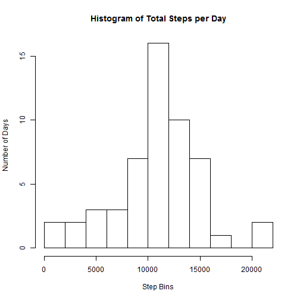
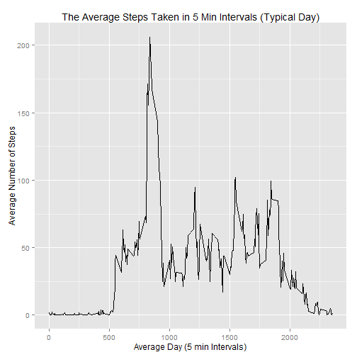
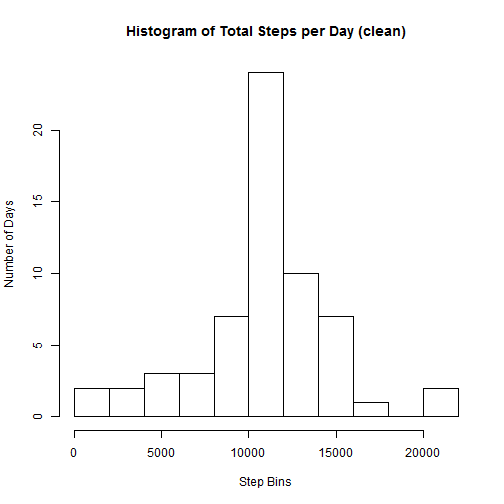
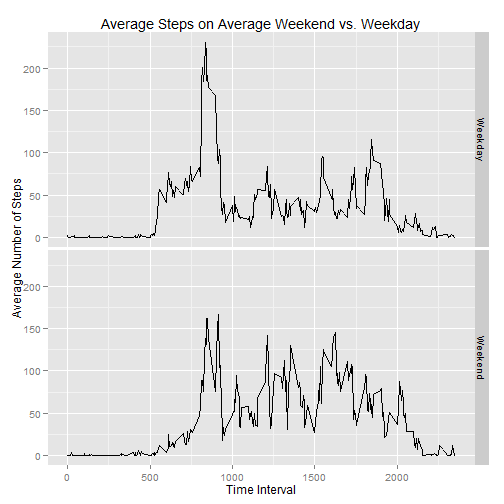

# Reproducible Research: Peer Assessment 1


## Loading and preprocessing the data


```r
library(ggplot2)
library(plyr)
data <- read.csv("activity.csv")
data2 <- data[complete.cases(data),]
```

## What is mean total number of steps taken per day?

```r
totalsteps <- aggregate(data2$steps,by=list(data2$date),FUN=sum)
{hist(as.numeric(totalsteps$x), 
      main = "Histogram of Total Steps per Day", 
      breaks = 10,
      xlab = "Step Bins", 
      ylab ="Number of Days")}
```

 

```r
mean <- mean(totalsteps$x)
median <- median(totalsteps$x)
paste("The mean is ",mean)
```

```
## [1] "The mean is  10766.1886792453"
```

```r
paste("The median is ",median)
```

```
## [1] "The median is  10765"
```

## What is the average daily activity pattern?

```r
intsteps <- aggregate(data2$steps,by=list(data2$interval),FUN=mean)
{qplot(x = Group.1, y = x, data = intsteps,
        geom="line",
        main = "The Average Steps Taken in 5 Min Intervals (Typical Day)",
        xlab = "Average Day (5 min Intervals)",
        ylab = "Average Number of Steps")}
```

 

```r
maxint = max(intsteps$x)
submaxintsteps <- subset(intsteps, x==maxint)
max5min <- submaxintsteps$Group.1

paste("The 5-min interval with the most average steps occurs at", max5min,", with ",as.integer(maxint)," steps.")
```

```
## [1] "The 5-min interval with the most average steps occurs at 835 , with  206  steps."
```

## Imputing missing values

```r
incomplete <- nrow(data) - nrow(data2)
paste("There are ",incomplete,"rows with missing data.")
```

```
## [1] "There are  2304 rows with missing data."
```

```r
d<-data
d2 <- merge(x = d, y = intsteps, by.x = "interval", by.y = "Group.1")

for(i in 1:nrow(d2)){
        if (is.na(d2[i,2])) {d2[i,2]<-d2[i,4]}
}

totalsteps2 <- aggregate(d2$steps,by=list(d2$date),FUN=sum)
{hist(as.numeric(totalsteps2$x), 
      main = "Histogram of Total Steps per Day (clean)", 
      breaks = 10,
      xlab = "Step Bins", 
      ylab ="Number of Days")}
```

 

```r
mean2 <- mean(totalsteps2$x)
median2 <- median(totalsteps2$x)
paste("The mean is ",mean2)
```

```
## [1] "The mean is  10766.1886792453"
```

```r
paste("The median is ",median2)
```

```
## [1] "The median is  10766.1886792453"
```

```r
paste("The population size grew by 2,304 missing values but the overall average and median were negligible since we input the average values for the missing numbers.")
```

```
## [1] "The population size grew by 2,304 missing values but the overall average and median were negligible since we input the average values for the missing numbers."
```

## Are there differences in activity patterns between weekdays and weekends?


```r
d3<-d2
d3$day <- weekdays(as.Date(d3$date))
d3$wkend <- "Weekday"
for(i in 1:nrow(d3)){
        if (d3[i,5]== "Saturday" | d3[i,5]== "Sunday") {d3[i,6]<-"Weekend"}
}
d3cut <- ddply(d3, c("wkend", "interval"), summarise, mean = mean(steps))

plot <- ggplot(data=d3cut, aes(x = interval, y = mean, group =1))+ geom_line()
plot <- plot + xlab("Time Interval") + ylab("Average Number of Steps")
plot <- plot + ggtitle("Average Steps on Average Weekend vs. Weekday") + facet_grid(wkend ~ .)
plot
```

 

